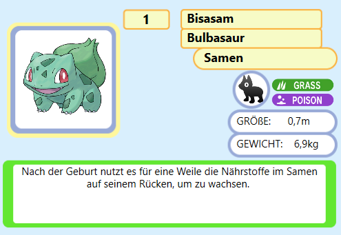

<h1 align="center">
   
  
   
      Integrated Pokédex
   
</h1>

<h4 align="center">This Pokedex involves every Pokemon from generation 1 up to generation 9</h4>

  <a href="#key-features">Key Features</a> •
  <a href="#how-to-use">How To Use</a> •
  <a href="#download">Download</a> •
  <a href="#credits">Credits</a> •
  <a href="#related">Related</a> •
  <a href="#license">License</a>

